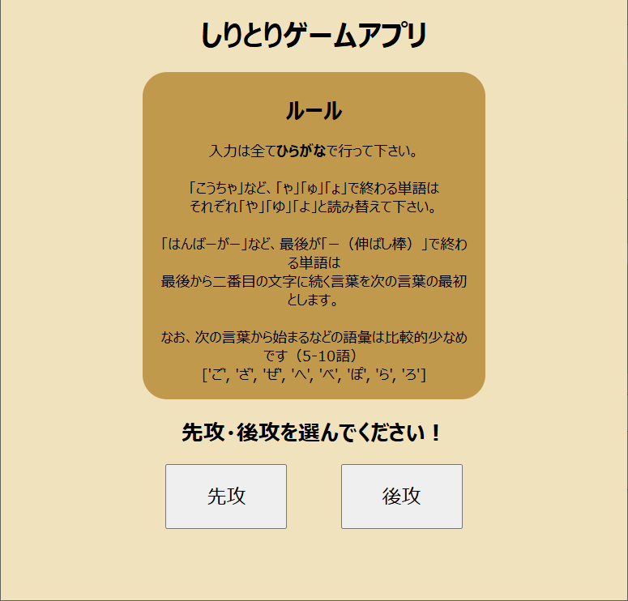
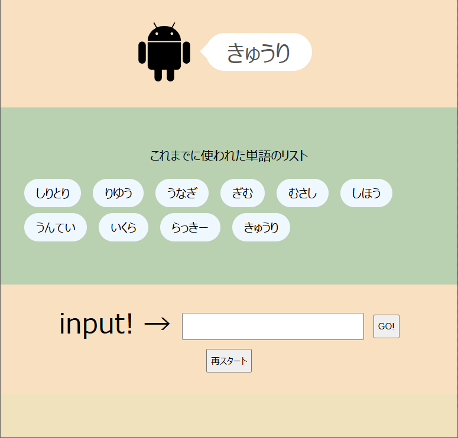

# しりとりアプリ
Python、Flaskの練習を兼ねて作りました。  
CPUはディレクトリ内にあるworddict.jsonを基に、こちらが入力した文字に続く言葉を返します。  
Renderにて公開しています → [リンク](https://shiritori-app.onrender.com/)

## スクリーンショット

  
  

## 遊び方
- 先攻または後攻を選ぶ。後攻を選んだ場合、CPUが辞書の中からランダムで一つ単語を選びます。  
- 小さい「ゃ」や「ゅ」などの文字で終わる文字の場合、大きな文字で返信します。  
- ユーザがわざと「ん」で終わる文字を入力した場合、またはCPUの辞書の単語がなくなるとゲーム終了です。  
> ℹ️ CPUの辞書は['ご', 'ざ', 'ぜ', 'へ', 'べ', 'ぽ', 'ら', 'ろ']の単語が少なめです。

## 技術スタック
- Python 3.12.6
- Flask 3.1.0
- pandas（しりとり用語彙データの加工・成形に使用）
- HTML / CSS
- Jinja2
- Bootstrap(androidのアイコンのみ)

## 使用データについて
CPUが使う辞書は以下のサイトのデータを使用・加工しています。  
[教育基本語彙データベース・日本語教育基本語彙データベース](https://mmsrv.ninjal.ac.jp/brfvep/)  
このうち「教育基本語彙データベース(2009年版B)」をpandasを用いて必要なデータのみ残したうえで、  
worddict.jsonとして保存しました。